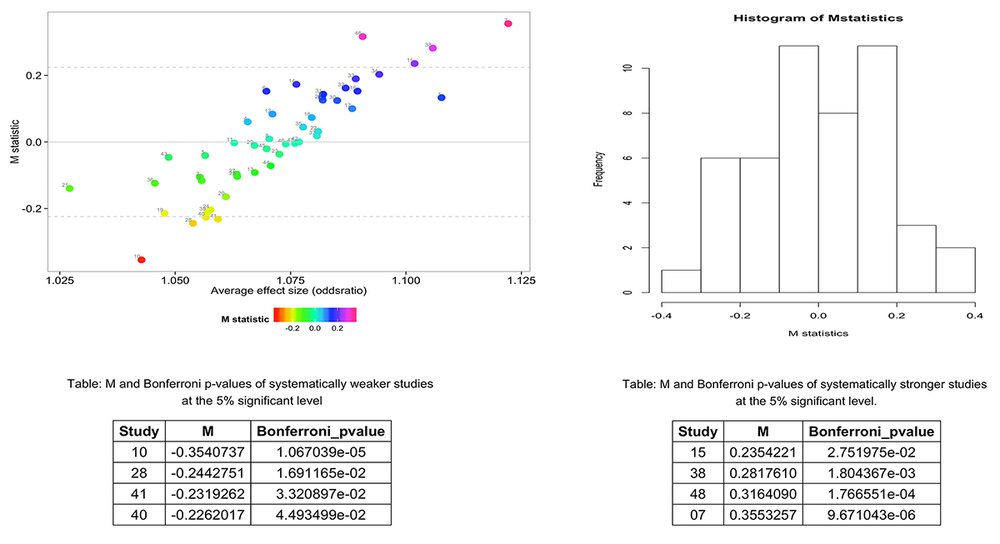
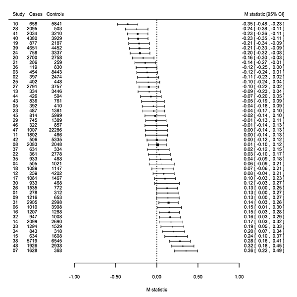

## Background


* Statistical heterogeneity can be described as consistent study effect-size differences among participating studies in a meta-analysis, across the array of genetic variants examined.

* The getmstatistic function `?getmstatistic` computes M statistics to quantitatively describe systematic heterogeneity in meta-analysis.

* M statistics are useful for identifying outlier studies which show null effects or consistently show stronger/weaker effects than average.

## Properties of the M-statistic

* M's power to detect systematic heterogeneity patterns increases with the number and strength of association of variants examined in the meta-analysis.

* M statistics can be calculated using a panel of known lead variants independently associated with the trait of interest or the GWAS significant lead variants in a meta-analysis.

* Furthermore, M's power is relatively indepenent of the number of studies in a meta-analysis.

* The M statistic can be applied to meta-analyses with few studies (e.g. 10 studies).


#### See the M statistic paper for details on the statistical theory:
Magosi LE, Goel A, Hopewell JC, Farrall M, on behalf of the CARDIoGRAMplusC4D Consortium (2017) 
Identifying systematic heterogeneity patterns in genetic association meta-analysis studies. 
PLoS Genet 13(5): e1006755. [https://doi.org/10.1371/journal.pgen.1006755](https://doi.org/10.1371/journal.pgen.1006755).


#### This vignette walks through the steps involved in carrying out an M analysis


---

## A few tips for a succesful M analysis

Prior to conducting an M analysis: 

* ensure that the variants that will be used to conduct the M analysis are independently associated with the trait of interest i.e. in linkage equilibrium.

* ensure that the effect alleles for participating studies in the meta-analysis are aligned. This can be achieved by "flipping" the beta-values (i.e. multiply by -1) of misaligned effect alleles.

* apply a study-level genomic corrrection to the standard errors to minimize false positives.

    For example: `gcse <- se * sqrt(lambda)`


## Data: heartgenes214

#### We shall use the heartgenes214 dataset for our M analysis.

```

heartgenes214 is a multi-ethnic GWAS meta-analysis dataset for coronary
artery disease.

It comprises summary data (effect-sizes and their corresponding standard errors) for 
48 studies (68,801 cases and 123,504 controls), at 214 lead variants independently 
associated with coronary artery disease (P < 0.00005, FDR < 5%). Of the 214 lead variants, 
44 are genome-wide significant (p < 5e-08). The meta-analysis dataset is based on individuals 
of: African American, Hispanic American, East Asian, South Asian, Middle Eastern and European 
ancestry. 

```

#### Note:
* The beta-values in heartgenes214 have already been flipped to align effect alleles.

* Also, the standard errors have been genomically controlled at the study-level. 


#### The data was sourced from:

Magosi LE, Goel A, Hopewell JC, Farrall M, on behalf of the CARDIoGRAMplusC4D Consortium (2017) 
Identifying systematic heterogeneity patterns in genetic association meta-analysis studies. 
PLoS Genet 13(5): e1006755. [https://doi.org/10.1371/journal.pgen.1006755](https://doi.org/10.1371/journal.pgen.1006755).


## The basics: Conducting an *M* analysis

The getmstatistic function requires the following variables for an M analysis:

* A numeric vector of beta-values i.e. study effect-sizes.
* A numeric vector of standard errors.
* A character vector of variant/SNP names.
* A character vector of study names.


```

# Load libraries  ------------------------------------------------

library(getmstatistic)  # for calculating M statistics
library(gridExtra)       # for generating tables

 
# Basic M analysis using heartgenes214  --------------------------

# heartgenes214 is a multi-ethnic GWAS meta-analysis dataset for coronary artery disease.
# ?heartgenes214 to view the dataset documentation.

head(heartgenes214)

# View the structure of the heartgenes214 dataset
str(heartgenes)

# Run M analysis on all 214 lead variants
# To view getmstatistic documentation ?getmstatistic or ?getm

getmstatistic_results <- getmstatistic(heartgenes214$beta_flipped, 
                                        heartgenes214$gcse, 
                                        heartgenes214$variants, 
                                        heartgenes214$studies)
getmstatistic_results


# Explore results generated by getmstatistic  --------------------

# Retrieve dataset of M statistics 
dframe <- getmstatistic_results$M_dataset

head(dframe)

str(dframe)

# Retrieve dataset of stronger than average studies (significant at 5% level)
getmstatistic_results$influential_studies_0_05
 
# Retrieve dataset of weaker than average studies (significant at 5% level)
getmstatistic_results$weaker_studies_0_05
 
# Retrieve number of studies and variants
getmstatistic_results$number_studies
getmstatistic_results$number_variants
 
# Retrieve expected mean, sd and critical M value at 5% significance level
getmstatistic_results$M_expected_mean
getmstatistic_results$M_expected_sd
getmstatistic_results$M_crit_alpha_0_05


```

## Understanding the plots generated by getmstatistic

 

M scatterplot: M statistics for each study in the meta-analysis (Y- axis) are plotted against the average variant effect size (expressed as odds ratios) (X-axis) in each study. 
    The dashed lines indicate the Bonferroni corrected 5% significance threshold (M= ±0.483) to allow for multiple testing of 48 studies. 
    Studies showing weaker (M < 0) than average genetic effects can be distinguished from those showing stronger (M > 0) than average effects.


## A step further: Exploring available options

```

# Run M analysis on GWAS significant lead variants  --------------------

# Subset the GWAS significant variants (p < 5e-08) in heartgenes214
heartgenes44 <- subset(heartgenes214, heartgenes214$fdr214_gwas46 == 2)

# Exploring getmstatistic options:
#     Estimate heterogeneity using "REML", default is "DL"
#     Modify x-axis of M scatterplot
#     Run M analysis verbosely
getmstatistic_results <- getmstatistic(heartgenes44$beta_flipped, 
                                        heartgenes44$gcse, 
                                        heartgenes44$variants, 
                                        heartgenes44$studies,
                                        tau2_method = "REML",
                                        x_axis_increment_in = 0.03, 
                                        x_axis_round_in = 3,
                                        verbose_output = TRUE)
getmstatistic_results


```

## Generating M statistic forest plots


```
library(metafor) # for conducting meta-analysis
library(dplyr)   # for sorting data.frames

# We shall use the results from the M analysis of the 214 lead variants in heartgenes214
# As a reminder, here is the command below:
getmstatistic_results <- getmstatistic(heartgenes214$beta_flipped, 
                                        heartgenes214$gcse, 
                                        heartgenes214$variants, 
                                        heartgenes214$studies)


# Sort getmstatistic_results dataframe by M statistics
getm_res_srtd <- dplyr::arrange(getmstatistic_results$M_dataset, M)
head(getm_res_srtd)


# Add on the case and control fields 


# First, drop duplicate study_names in the sorted getmsatistic_results
getm_res_srtd_nodups <- subset(getm_res_srtd, getm_res_srtd$snp == 5)

# Checking dimensions to confirm that we have 48 studies
str(getm_res_srtd_nodups)

# Second, drop duplicate study_names in heartgenes
heartgenes214_nodups <- subset(heartgenes214, heartgenes214$variants == "chr14:75614504:I")
str(heartgenes214_nodups)

# Third, merge the two dataframes to add on the cases and controls
getm_res_plus_cases_ctrls <- merge(getm_res_srtd_nodups, heartgenes214_nodups[, c("studies", "cases", "controls")], by.x="study_names_in", by.y="studies")

# Sort data.frame by M statistics
getm_res_plus_cases_ctrls_srtd <- dplyr::arrange(getm_res_plus_cases_ctrls, M)


# Compute inverse-variance weighted fixed effects model
# using fixed effects model to get variable box size
metafor_results_fe <- metafor::rma.uni(yi = getm_res_plus_cases_ctrls_srtd[, "M"], sei = getm_res_plus_cases_ctrls_srtd[, "M_se"], weighted = T, slab = sprintf("%02.0f", getm_res_plus_cases_ctrls_srtd[, "study"]), method = "FE")
metafor_results_fe


# Compute inverse-variance weighted random effects model
metafor_results_dl <- metafor::rma.uni(yi = getm_res_plus_cases_ctrls_srtd[, "M"], sei = getm_res_plus_cases_ctrls_srtd[, "M_se"], weighted = T, knha = T, slab = sprintf("%2.0f", getm_res_plus_cases_ctrls_srtd[, "study"]), method = "DL")
metafor_results_dl


# Plotting:

# set margins
par(mar=c(4,4,1,2))

# generate forest plot
forest(metafor_results_fe, xlim=c(-1.8, 1.6), at=c(-1, -0.5, 0, 0.5, 1), cex=0.66, xlab = "M statistic", ilab=cbind(getm_res_plus_cases_ctrls_srtd$cases, getm_res_plus_cases_ctrls_srtd$controls), ilab.xpos = c(-1.4,-1.1), ilab.pos = c(2,2), addfit=F)

# Adding labels
text(1.6, 50, "M statistic [95% CI]", pos=2, cex=0.66)
text(-1.6, 50, "Cases", pos=4, cex=0.66)
text(-1.39, 50, "Controls", pos=4, cex=0.66)
text(-1.8, 50, "Study", pos=4, cex=0.66)

```


